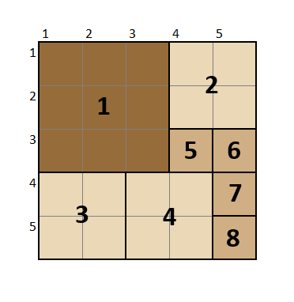
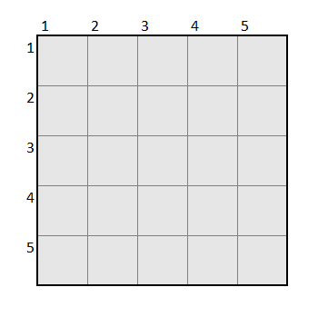
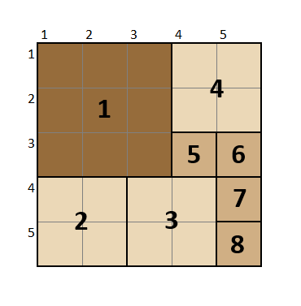
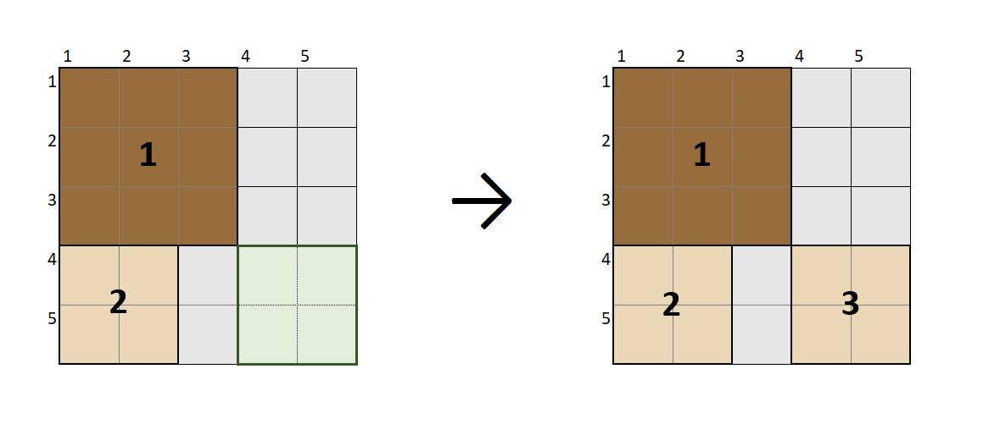

# Packing Square
Este es un problema combinatorio específico, el cual consiste en ubicar una serie de cuadrados en una base cuadrada cumpliendo con la condición de que ninguno se traslape con los otros.

## Modelando el problema
Para identificar los cuadrados en la base, se utilizarán dos variables:
  
  * Su posición en X
  * Su posición en Y

Estás coordenadas representarán el lugar de la esquina superior derecha de cada cuadrado. De la imagen superior, se puede entender lo siguiente:
  * Cuadrado 1 en la posición (1,1)
  * Cuadrado 2 en la posición (4,1) 
  * Cuadrado 3 en la posición (1,4)
  * ...

## Caso de ejemplo
Se ha considerado una base cuadrada de lado 5. Se dispondrá de 8 cuadrados a ubicar en ella: 

  * Un cuadrado de lado 3
  * Tres cuadrados de lado 2
  * Cuatro cuadrados de lado 1

Agrupandose todos ellos en una lista ordenada por el lado de los cuadrados:

    SQUARES = [3,2,2,2,1,1,1,1]
    
## Definición de estados
Para modelar los estados se utilizará una estructura que contiene dos arreglos de numeros:

    # Estados:
    X[] : Representa los valores en X de los 8 cuadrados (SQUARES)
    Y[] : Representa los valores en Y de los 8 cuadrados (SQUARES)

### Ejemplo de Estado Inicial
Para el estado inicial se considerá la base cuadrada vacía
    
    # Estado 0
    X[] : [0,0,0,0,0,0,0,0]
    Y[] : [0,0,0,0,0,0,0,0]
    

    
### Ejemplo de Estado Final
El estado final se alcanzará cuando se complete la ultima posición del arreglo de valores obteniendo la posición de los 8 cuadrados en la base.

    # Estado final
    X[] : [1, 1, 3, 4, 4, 5, 5, 5] 
    Y[] : [1, 4, 4, 1, 3, 3, 4, 5]
    

    
## Acciones
Para nuestro modelo, una accion corresponde a colocar un cuadrado en la base, es por ello que se creó la siguiente estructura

    # Acciones:
    i : Representa el indice de la lista SQUARES que estaríamos colocando en la base
    x : Representa el valor en X del cuadrado
    y : Representa el valor en Y del cuadrado
    
### Obtener lista de acciones
Para obtener la lista de acciones posibles, se necesita comprobar en todas las posiciones que puede tener el cuadrado, sin desbordar el tablero.
Sin considerar el primer cuadrado a colocar, el cual no tiene restricciones de traslapar ningun elemento, se debe verificar las colisiones que genera
cada opción. Una vez validado, se puede agregar la acción a la lista para finalmente ser retornada. 

## Transiciones
Para transitar al nuevo estado, se genera una copia del estado actual y se le aplica la acción correspondiente. Luego se retorna.

## Heurística
La evaluación del mejor nodo a seguir estará dada por la mayor area cuadrada sin ocupar. Por ejemplo, si quisieramos poner el tercer cuadrado, de lado 2,
podemos apreciar que el area cuadrada más grande por abarcar sería de lado 2 (cuadro verde)

